# Friendex — Specification Analysis: Current State

## Executive Summary

Friendex is a single-file Discord bot (`bot.py`, not yet implemented) in which every server member is a tradeable "stock" whose price moves based on measured Discord activity (messages, voice time, reactions, VC pings) and direct trade pressure. The full design exists in one 1,660-line Python skeleton document. The architecture mixes Discord event handling, domain logic, price arithmetic, and JSON persistence into the same functions throughout, with no layer separation. Four global in-memory dicts act as the entire database, flushed to JSON after every mutation. Two ephemeral in-memory dicts track live voice sessions and VC ping state and are lost on restart. The spec implies six background tasks, four Discord event handlers, one additional bot event, and fifteen user-facing commands, all operating on shared mutable global state without any concurrency guard.

---

## Table of Contents

1. [Executive Summary](#executive-summary)
2. [Inventory](#inventory)
   - [Global Constants](#global-constants)
   - [Global State Variables](#global-state-variables)
   - [Helper / Domain Functions](#helper--domain-functions)
   - [Background Tasks](#background-tasks)
   - [Discord Event Handlers](#discord-event-handlers)
   - [Bot Commands](#bot-commands)
3. [Data Model](#data-model)
4. [Data Flow](#data-flow)
5. [Coupling Hotspots](#coupling-hotspots)
6. [Tech Debt the Spec Already Implies](#tech-debt-the-spec-already-implies)
7. [Risk Register](#risk-register)
8. [Mermaid Diagram](#mermaid-diagram)
9. [Open Questions](#open-questions)

---

## Inventory

### Global Constants

| Name | Type | Value | Purpose |
|------|------|-------|---------|
| `INITIAL_CASH` | `int` | `10000` | Starting cash balance for new users |
| `INITIAL_PRICE` | `int` | `100` | Starting stock price for new users |
| `DAILY_REWARD` | `int` | `500` | Base daily claim amount |
| `STREAK_BONUS` | `int` | `500` | Extra reward on 7-day streak |
| `PRICE_IMPACT_K` | `float` | `0.5` | Linear scaling factor for trade-driven price moves |
| `INACTIVITY_THRESHOLD` | `int` | `14400` (4h in seconds) | Seconds before inactivity decay fires |
| `INACTIVITY_DECAY` | `float` | `0.04` | 4% price drop per inactivity decay event |
| `LIQUIDATION_THRESHOLD` | `float` | `1.5` | Auto-cover threshold: 150% of short entry price |
| `MIN_PRICE` | `float` | `70.00` | Absolute price floor |
| `MARKET_OPEN` | `time` | `06:30` | Market open time |
| `MARKET_CLOSE` | `time` | `06:25` | Market close time (spec says 04:30; actual value in skeleton is `06:25` — see Open Questions) |
| `TIMEZONE_OFFSET_HOURS` | `int` | `0` | UTC offset adjustment |
| `SHORT_FREEZE_MINUTES` | `int` | `30` | Minutes until a short position is frozen |
| `ACTIVITY_TICK_MINUTES` | `int` | `15` | Background price-tick interval |
| `VC_PING_ROLES` | `list[int]` | 4 role IDs | Roles whose mentions trigger VC ping bonuses |
| `VOICE_PING_WINDOW_SECONDS` | `int` | `5400` (1.5h) | Window for VC ping bonus eligibility |
| `FAST_RESPONSE_SECONDS` | `int` | `120` | <= 2 min response → 3x speed multiplier |
| `MEDIUM_RESPONSE_SECONDS` | `int` | `300` | <= 5 min response → 2x speed multiplier |
| `VC_EXTRA_BOOST_INTERVAL_SECONDS` | `int` | `900` | Interval for 3% periodic VC responder boost |
| `PHOTO_BONUS_CHANNEL_IDS` | `set[int]` | 2 channel IDs | Channels where media gets extra `role_ping_join_minutes` bonus |
| `HEDGE_FUND_BASE_APY` | `float` | `0.15` | 15% nominal monthly APY for fund investors |
| `EARLY_WITHDRAW_PENALTY` | `float` | `0.05` | Per-event APY penalty reduction |
| `PENALTY_DURATION_DAYS` | `int` | `14` | Days a withdrawal penalty remains active |
| `EVENTS_WALLET_USER_ID` | `str` | `"events_wallet"` | Pseudo-user key in `funds_data` for events treasury |
| `DATA_DIR` | `str` | `"data"` | Relative path to JSON storage directory |
| `TRADE_COOLDOWN_SECONDS` | `int` | `900` (15 min) | Cooldown between short/cover operations per user |
| `DISCIPLINE_PENALTY` | `float` | `0.17` | 17% price drop on timeout or ban |

---

### Global State Variables

| Name | Type | Persistence | Reset on Restart | Purpose |
|------|------|-------------|-----------------|---------|
| `users_data` | `Dict[str, dict]` | `users.json` | No | Accounts, portfolios, activity metrics, streaks |
| `funds_data` | `Dict[str, dict]` | `funds.json` | No | Hedge fund definitions and balances |
| `prices_data` | `Dict[str, dict]` | `prices.json` | No | Current prices, 24h history, ATH |
| `fund_penalty_history` | `Dict[str, dict]` | `fund_penalties.json` | No | Early-withdrawal penalty records |
| `voice_sessions` | `Dict[str, dict]` | None | **Yes** | Live VC session state per user |
| `voice_ping_sessions` | `Dict[int, dict]` | None | **Yes** | Active VC ping events |
| `last_trade_time` | `Dict[str, datetime]` | None | **Yes** | Per-user short/cover cooldown timestamps |
| `vc_extra_boosts` | `Dict[str, dict]` | None | **Yes** | Extra 3% VC boost tracking for 11th+ responders |

---

### Helper / Domain Functions

| Function | Inputs | Returns | Side Effects | Persistence |
|----------|--------|---------|--------------|-------------|
| `get_now_with_offset()` | — | `datetime` | None | None |
| `is_trading_day(dt)` | `datetime` | `bool` | None | None |
| `is_sunday(dt)` | `datetime` | `bool` | None | None |
| `is_market_open(dt)` | `datetime` | `bool` | None | None |
| `is_trade_on_cooldown(user_id)` | `str` | `Optional[int]` (seconds remaining) | None | None |
| `set_trade_time(user_id)` | `str` | None | Mutates `last_trade_time` | None |
| `ensure_data_dir()` | — | None | Creates `data/` directory if absent | Filesystem |
| `load_data()` | — | None | Replaces all four global dicts from JSON files | Reads 4 JSON files |
| `save_data()` | — | None | Writes all four global dicts to JSON | Writes 4 JSON files |
| `ensure_user(user_id)` | `str` | None | Creates user record in `users_data` if absent | `save_data()` on creation |
| `ensure_price(user_id)` | `str` | None | Creates price record in `prices_data` if absent; backfills `all_time_high` | `save_data()` on creation/backfill |
| `update_price_record(user_id, new_price)` | `str`, `float` | None | Mutates `prices_data[user_id]`; appends to history; prunes history older than 24h | None (caller must call `save_data()`) |
| `ensure_fund(user_id)` | `str` | None | Creates fund record in `funds_data` if absent | `save_data()` on creation |
| `ensure_events_wallet()` | — | None | Creates events wallet in `funds_data` if absent | None |
| `calculate_net_worth(user_id)` | `str` | `float` | Calls `ensure_user`, `ensure_price` | May call `save_data()` via `ensure_*` |
| `apply_trade_price_impact(target_id, volume, is_buy)` | `str`, `int`, `bool` | None | Mutates `prices_data`; applies linear impact formula; enforces MIN_PRICE | `save_data()` |
| `get_24h_price_change(user_id)` | `str` | `float` | Calls `ensure_price` | May call `save_data()` via `ensure_price` |
| `calculate_trending_score(activity)` | `dict` | `float` | None (pure computation with soft-caps and time-decay) | None |
| `get_engagement_tier(score, all_scores)` | `float`, `List[float]` | `str` | None | None |
| `reset_activity_bucket(bucket)` | `dict` | None | Mutates the bucket dict in-place | None |
| `compute_activity_return(user_id)` | `str` | `float` (% return) | Reads `users_data` | None |
| `apply_floor_stall(current_price, proposed_price)` | `float`, `float` | `float` | None (pure price math) | None |
| `is_voice_ping_message(message)` | `discord.Message` | `bool` | None | None |
| `reward_voice_ping_response(responder_id, channel_id)` | `str`, `int` | None | Mutates `users_data`, `prices_data`, `voice_sessions`, `voice_ping_sessions`, `vc_extra_boosts` | None (caller must call `save_data()`) |
| `get_user_penalty_apr(user_id)` | `str` | `float` | None | None |
| `apply_early_withdraw_penalty(user_id)` | `str` | None | Mutates `fund_penalty_history` | `save_data()` |
| `trading_allowed(ctx)` | `commands.Context` | `Optional[str]` | None | None |
| `get_intro_embed()` | — | `discord.Embed` | None | None |

---

### Background Tasks

| Task | Decorator / Interval | Purpose | Data Read | Data Mutated | Persistence |
|------|---------------------|---------|-----------|--------------|-------------|
| `activity_price_step` | `@tasks.loop(minutes=15)` | Apply activity-based price tick to every user using weekly engagement score | `users_data`, `prices_data` | `prices_data` | `save_data()` at end |
| `inactivity_price_decay` | `@tasks.loop(minutes=5)` | Decay price 4% for users inactive > 4 hours | `users_data`, `prices_data` | `prices_data` | `save_data()` at end |
| `short_liquidation_check` | `@tasks.loop(minutes=5)` | Auto-cover short positions when price >= 150% of entry | `users_data`, `prices_data` | Placeholder `pass` body — **not implemented** | None |
| `short_freeze_check` | `@tasks.loop(minutes=5)` | Mark short positions `frozen=True` after 30 minutes | `users_data` | `users_data["portfolio"]["short"][*]["frozen"]` | `save_data()` |
| `vc_extra_boost_step` | `@tasks.loop(minutes=15)` | Apply 3% price boost every 15 min to VC responders beyond first 10 who are still in VC within the 1.5h window | `vc_extra_boosts`, `voice_sessions`, `prices_data` | `prices_data`, `vc_extra_boosts` | `save_data()` |
| `monthly_rollover_check` | `@tasks.loop(hours=1)` | Monthly net worth rollover; placeholder `pass` body — **not implemented** | None | None | None |

**Note:** `on_ready` starts all six tasks. The order in the spec is: `monthly_rollover_check`, `inactivity_price_decay`, `short_liquidation_check`, `short_freeze_check`, `activity_price_step`, `vc_extra_boost_step`.

---

### Discord Event Handlers

| Handler | Trigger | Logic Summary | Data Mutated | Persistence |
|---------|---------|---------------|--------------|-------------|
| `on_ready` | Bot connects | Calls `load_data()`, `ensure_events_wallet()`, starts all 6 background tasks | None | None |
| `on_message` | Any non-bot message | Ensures user/price; increments `text_msgs` or `media_msgs`; increments `reply_count` if reply; detects VC ping messages and writes to `voice_ping_sessions`; updates `last_activity` | `users_data`, `voice_ping_sessions` | `save_data()` |
| `on_reaction_add` | Any non-bot reaction | Ensures user; increments `reaction_count` and `week` counterpart; updates `last_activity` | `users_data` | `save_data()` |
| `on_voice_state_update` | Member joins/leaves/switches VC | Join: creates `voice_sessions` entry, calls `reward_voice_ping_response`; Leave: accumulates voice minutes, unique channels, role_ping minutes, applies 50% boost if >= 60 min stay, deletes session; Switch: finalizes old session, creates new one | `users_data`, `prices_data`, `voice_sessions` | `save_data()` |
| `on_member_update` | Member attribute change | Detects new timeout (`timed_out_until`) and applies 17% price discipline penalty | `prices_data` | `save_data()` |
| `on_member_ban` | Member banned from guild | Applies 17% price discipline penalty | `prices_data` | `save_data()` |

---

### Bot Commands

| Command | Aliases | Inputs | Core Logic | Data Mutated | Persistence | Response |
|---------|---------|--------|------------|--------------|-------------|----------|
| `$balance` | `$mb` | None | Reads cash, calculates net worth, reads fund cash | `users_data["net_worth"]` | `save_data()` | Embed: Cash, Net Worth, Hedge Fund (delete_after=15) |
| `$daily` | None | None | Checks `daily.last_claim`; if eligible, increments streak or resets; adds reward | `users_data["cash_balance"]`, `users_data["daily"]` | `save_data()` | Text confirmation (delete_after=15) |
| `$price` | `$ticker`, `$my_stock` | Optional `@user` | Reads current price, 24h change, 24h high/low, ATH | None | May trigger `ensure_price` | Embed: price stats (delete_after=15) |
| `$buy` | None | `@user`, `shares: int` | Validates market hours (Sunday buy allowed); deducts cash; updates long portfolio (weighted avg entry); calls `apply_trade_price_impact` | `users_data["cash_balance"]`, `users_data["portfolio"]["long"]`, `prices_data` | `save_data()` | Text confirmation (delete_after=15) |
| `$sell` | None | `@user`, `shares: int` | Validates market hours; checks position; adds revenue to cash; calls `apply_trade_price_impact` | `users_data["cash_balance"]`, `users_data["portfolio"]["long"]`, `prices_data` | `save_data()` | Text confirmation (delete_after=15) |
| `$short` | None | `@user`, `shares: int` | Validates market hours; checks combined cash+50%-of-fund collateral; locks collateral; writes short position; calls `apply_trade_price_impact`; sets trade cooldown | `users_data["cash_balance"]`, `users_data["portfolio"]["short"]`, `funds_data["cash_balance"]`, `prices_data`, `last_trade_time` | `save_data()` | Text confirmation (delete_after=15) |
| `$cover` | None | `@user`, `shares: int` | Validates market hours; checks position; checks for frozen flag; deducts cover cost; releases proportional collateral back to cash and fund; credits P&L if profitable; sets trade cooldown | `users_data["cash_balance"]`, `users_data["portfolio"]["short"]`, `funds_data["cash_balance"]`, `last_trade_time` | `save_data()` | Text confirmation (delete_after=15) |
| `$portfolio` | `$pf`, `$mp` | Optional `@user` | Iterates long and short positions; resolves member objects; calculates current value and P&L per position | None | None | Embed (delete_after=15) |
| `$fund create` | — | Optional fund name string | Ensures fund exists; renames if name provided | `funds_data["name"]` | `save_data()` | Text confirmation (delete_after=15) |
| `$fund info` | — | Optional `@user` | Reads fund balance, investor count, effective APY minus penalty | None | None | Embed (delete_after=15) |
| `$fund withdraw` | — | `amount: float` | Checks balance; applies early-withdrawal penalty if day != 1; transfers from fund to user cash | `funds_data["cash_balance"]`, `users_data["cash_balance"]`, `fund_penalty_history` | `save_data()` | Text confirmation (delete_after=15) |
| `$fund send_events` | — | `amount: float` | Transfers from user fund to events wallet; no APY penalty | `funds_data["cash_balance"]` (both source and events wallet) | `save_data()` | Text confirmation (delete_after=15) |
| `$trending` | None | None | Iterates all users; calculates weekly trending scores; sorts; resolves member objects; reads prices and 24h change | None | None | Embed top-15 (delete_after=15) |
| `$mystats` | None | None | Reads today and week activity buckets; lists boost milestones | None | None | Embed (delete_after=15) |
| `$optin` | None | None | Sets `opt_in=True`; shows intro embed once if not shown | `users_data["opt_in"]`, `users_data["intro_shown"]` | `save_data()` | Embed + text (delete_after=15) |
| `$optout` | None | None | Sets `opt_in=False` | `users_data["opt_in"]` | `save_data()` | Text (delete_after=15) |
| `$game_intro` | None | None (admin-only: `manage_guild`) | Posts intro embed | None | None | Embed (no delete_after) |
| `$help` | None | None | Posts static help embed | None | None | Embed (no delete_after) |

---

## Data Model

### `users_data[user_id]`

Key is a string Discord user ID (`str(member.id)`).

```
{
  "cash_balance": float,            // current trading cash
  "net_worth": float,               // last-calculated net worth (stale between $balance calls)
  "month_start_net_worth": float,   // baseline for monthly rollover (rollover task is a stub)
  "portfolio": {
    "long": {
      "<target_user_id>": {
        "shares": int,
        "avg_entry": float          // weighted average entry price
      }
    },
    "short": {
      "<target_user_id>": {
        "shares": int,
        "entry_price": float,       // weighted average short entry price
        "locked_cash": float,       // portion of collateral from cash
        "locked_fund": float,       // portion of collateral from fund
        "created_at": str,          // ISO datetime of position open
        "frozen": bool              // True after SHORT_FREEZE_MINUTES
      }
    }
  },
  "activity": {
    "today": {
      "text_msgs": int,
      "media_msgs": int,
      "voice_minutes": float,
      "voice_unique_channels": list[str],   // channel IDs as strings
      "reaction_count": int,
      "reply_count": int,
      "role_ping_joins": float,             // float because host gets +0.5 per responder
      "role_ping_join_minutes": float,
      "timestamp": str                      // ISO datetime bucket was last reset
    },
    "week": { /* same structure as today */ }
  },
  "daily": {
    "last_claim": str | null,       // ISO datetime or null
    "streak": int
  },
  "last_activity": str,             // ISO datetime of last message/reaction/VC event
  "opt_in": bool,
  "intro_shown": bool
}
```

**Invariants:**
- `cash_balance` must not go negative (enforced in buy/sell/short/cover/cover commands; no lock).
- `portfolio.long` entries are removed when `shares == 0`.
- `portfolio.short` entries are removed when `shares == 0` after covering.
- `net_worth` is only refreshed when `$balance` is called — it is stale at all other times.
- `activity.today` and `activity.week` are never reset by any implemented task (daily/weekly reset is not in the skeleton — see Open Questions).
- `role_ping_joins` is a float because the host receives +0.5 per responding user.

---

### `funds_data[user_id]`

Key is a string Discord user ID, or the literal `"events_wallet"`.

```
{
  "name": str,
  "manager_id": str,        // Discord user ID or "events_wallet"
  "cash_balance": float,
  "investors": {}           // defined in schema but never populated in spec skeleton
}
```

**Invariants:**
- `cash_balance` must not go negative (enforced in withdraw and send_events commands; no lock).
- The `investors` dict is declared in `ensure_fund` but no code in the spec writes to it — invest/APY accrual logic is absent from the skeleton.
- The events wallet is a pseudo-user fund and has no penalty logic.

---

### `prices_data[user_id]`

Key is a string Discord user ID.

```
{
  "current": float,
  "history": [
    { "price": float, "timestamp": str }   // pruned to last 24h on every update
  ],
  "high_24h": float,
  "low_24h": float,
  "all_time_high": float
}
```

**Invariants:**
- `current` is always >= `MIN_PRICE` after any price-setting operation (enforced by `apply_floor_stall` and direct `max(…, MIN_PRICE)` calls).
- `high_24h` / `low_24h` are never reset — they accumulate monotonically with each `update_price_record` call. They are labeled 24h but behave as all-time unless the record is recreated (see Open Questions).
- `history` is pruned at write time to entries within the last 24 hours.
- `all_time_high` is backfilled in `ensure_price` if missing.

---

### `fund_penalty_history[user_id]`

Key is a string Discord user ID.

```
{
  "penalty_apr": float,      // cumulative APY penalty (additive per early withdrawal)
  "penalty_until": str       // ISO datetime when penalty expires
}
```

**Invariants:**
- Penalty accumulates additively on repeated early withdrawals; it is never capped.
- Expiry is re-set to `now + 14 days` on each early withdrawal regardless of any remaining existing penalty.
- No cleanup task removes expired entries from this dict or the JSON file (entries linger after expiry, they are simply ignored by `get_user_penalty_apr`).

---

## Data Flow

### Commands

**`$balance` / `$mb`**
1. Input: `ctx.author.id`
2. `ensure_user` → creates record if new
3. `ensure_fund` → creates fund if new
4. `calculate_net_worth` → reads all long/short positions and current prices; may call `ensure_price` (which calls `save_data()` on first access)
5. Mutates `users_data[user_id]["net_worth"]` = computed value
6. `save_data()` — writes all four JSON files
7. Discord: `ctx.send(embed)` delete_after=15

---

**`$daily`**
1. Input: `ctx.author.id`
2. `ensure_user`
3. Reads `users_data[user_id]["daily"]["last_claim"]`; computes eligibility
4. If ineligible: `ctx.send(error)` return
5. Increments or resets streak; sets reward amount (+500 bonus on streak==7, resets streak to 0)
6. Mutates `cash_balance += reward`, `daily.last_claim = now`, `daily.streak`
7. `save_data()`
8. Discord: `ctx.send(confirmation)` delete_after=15

---

**`$buy`**
1. Input: `@target`, `shares`
2. Validates `shares > 0`
3. Market hours check (Sunday buy is intentionally allowed — `$buy` skips the `trading_allowed` guard when `is_sunday`)
4. Self-trade guard
5. `ensure_user(buyer)`, `ensure_price(target)`
6. Reads `current_price`; computes `cost = current_price * shares`
7. Checks `cash_balance >= cost`
8. Mutates `cash_balance -= cost`
9. Updates `portfolio.long[target_id]` (weighted avg entry on add)
10. `apply_trade_price_impact(target_id, shares, is_buy=True)` → mutates `prices_data`, calls `save_data()`
11. `save_data()`
12. Discord: confirmation

---

**`$sell`**
1. Input: `@target`, `shares`
2. Validates; market hours check (no Sunday exception)
3. `ensure_user`, `ensure_price`
4. Checks position exists with sufficient shares
5. Computes `revenue = current_price * shares`
6. Mutates `cash_balance += revenue`; decrements or removes `portfolio.long[target_id]`
7. `apply_trade_price_impact(target_id, shares, is_buy=False)` → price drop + save
8. `save_data()`
9. Discord: confirmation

---

**`$short`**
1. Validates; market hours; self-trade guard
2. `ensure_user`, `ensure_price`, `ensure_fund`
3. Computes `notional = current_price * shares`
4. Collateral check: `cash + 50% of fund_cash >= notional`
5. Locks collateral from cash first, then fund if needed
6. Mutates `cash_balance`, `funds_data.cash_balance`, `portfolio.short`
7. If existing unfrozen position: weighted avg merge; if frozen: reject
8. `apply_trade_price_impact(target_id, shares, is_buy=False)` → price drop + save
9. `set_trade_time(user_id)` → mutates `last_trade_time`
10. `save_data()`
11. Discord: confirmation

---

**`$cover`**
1. Validates; market hours
2. `ensure_user`, `ensure_price`, `ensure_fund`
3. Checks short position exists with sufficient shares
4. Checks frozen flag — rejects if frozen
5. Computes `cost = current_price * shares`; checks `cash_balance >= cost`
6. Deducts cost; computes P&L = `(entry_price - current_price) * shares`
7. Releases proportional locked collateral back to cash and fund
8. Credits positive P&L to cash
9. Decrements or removes position
10. `set_trade_time(user_id)`
11. `save_data()`
12. Discord: confirmation with P&L

---

**`$portfolio` / `$pf` / `$mp`**
1. Input: optional `@target` (defaults to author)
2. `ensure_user`
3. Iterates `portfolio.long`: resolves member, reads current price, computes value and P&L
4. Iterates `portfolio.short`: resolves member, reads current price, computes P&L, shows FROZEN flag
5. No mutations
6. Discord: embed

---

**`$fund create`**
1. `ensure_fund` → creates if absent
2. If name args provided: mutates `funds_data[user_id]["name"]`, `save_data()`
3. Discord: confirmation

**`$fund info`**
1. `ensure_fund`; reads balance, investor count
2. Calls `get_user_penalty_apr` → reads `fund_penalty_history`
3. Computes effective APY
4. No mutations
5. Discord: embed

**`$fund withdraw`**
1. Validates amount; `ensure_user`, `ensure_fund`
2. Checks `fund.cash_balance >= amount`
3. If `now.day != 1`: calls `apply_early_withdraw_penalty` → mutates `fund_penalty_history`, `save_data()`
4. Mutates `fund.cash_balance -= amount`, `user.cash_balance += amount`
5. `save_data()`
6. Discord: confirmation

**`$fund send_events`**
1. Validates amount; `ensure_user`, `ensure_fund`, `ensure_events_wallet`
2. Checks fund balance
3. Mutates source fund balance and events wallet balance
4. `save_data()`
5. Discord: confirmation

---

**`$trending`**
1. Iterates all `users_data`; calls `calculate_trending_score(week_activity)` for each
2. Filters zero scores; sorts descending; slices top 15
3. For each: resolves guild member (skips if not found), reads price and 24h change
4. No mutations
5. Discord: embed

---

**`$mystats`**
1. `ensure_user`; reads today and week activity buckets
2. Evaluates boost milestone flags
3. No mutations
4. Discord: embed

---

**`$optin` / `$optout`**
1. `ensure_user`
2. Sets `opt_in` flag
3. `$optin` additionally shows intro embed once (`intro_shown` gate)
4. `save_data()`
5. Discord: response

---

### Background Tasks

**`activity_price_step` (every 15 min)**
1. Iterates all `users_data` keys
2. `ensure_price` for each
3. `compute_activity_return(user_id)` → reads `users_data[user_id].activity.week` → `calculate_trending_score`
4. Computes `proposed_price = current * (1 + ret_pct/100)`
5. `apply_floor_stall` → clamps
6. `update_price_record` → appends to history, updates high/low/ATH, prunes old history
7. `save_data()` once at end

---

**`inactivity_price_decay` (every 5 min)**
1. Iterates all `users_data`; reads `last_activity` timestamp
2. If inactive > 4 hours: `ensure_price`; apply 4% decay via `apply_floor_stall`; `update_price_record`
3. `save_data()` once at end

---

**`short_liquidation_check` (every 5 min)**
- Body is `pass`. Auto-liquidation of shorts at 150% of entry price is described in CLAUDE.md and spec constants but not implemented in the skeleton.

---

**`short_freeze_check` (every 5 min)**
1. Iterates all users' short portfolios
2. For each position with a `created_at` field: compute age in minutes
3. If age >= `SHORT_FREEZE_MINUTES` (30): set `position["frozen"] = True`
4. `save_data()`

---

**`vc_extra_boost_step` (every 15 min)**
1. Iterates `vc_extra_boosts`
2. Removes entries past `end_time`
3. Skips entries boosted less than 900 seconds ago
4. Skips users not currently in `voice_sessions`
5. Applies 3% boost via `apply_floor_stall` + `update_price_record`
6. Updates `last_boost` timestamp
7. `save_data()`

---

**`monthly_rollover_check` (every 1 hour)**
- Body is `pass`. Purpose: capture `month_start_net_worth` for monthly P&L tracking.

---

### Event Handlers (Data Flow)

**`on_message`**
- Input → user's message
- `ensure_user`, `ensure_price`
- Update `last_activity`
- If `message.attachments`: increment `media_msgs` (today + week); if channel in `PHOTO_BONUS_CHANNEL_IDS`: add 10.0 to `role_ping_join_minutes`
- Else: increment `text_msgs` (today + week)
- If reply: increment `reply_count` (today + week)
- If author in voice and message is a VC ping: write new entry to `voice_ping_sessions`; increment `role_ping_joins`
- `save_data()`
- `await bot.process_commands(message)` — commands are handled via this call

**`on_reaction_add`**
- Increment `reaction_count` (today + week)
- Update `last_activity`
- `save_data()`

**`on_voice_state_update`**
- Join: create `voice_sessions` entry; call `reward_voice_ping_response`; `save_data()`
- Leave: accumulate `voice_minutes`, `voice_unique_channels`, `role_ping_join_minutes`; apply 50% price boost if stayed >= 60 min; delete session; `save_data()`
- Switch: finalize old session metrics then create new session; call `reward_voice_ping_response`; `save_data()`

**`on_member_update`**
- If `timed_out_until` newly set: apply 17% price discipline penalty; `save_data()`

**`on_member_ban`**
- Apply 17% price discipline penalty; `save_data()`

---

## Coupling Hotspots

| Location | Coupling Description | Why It Resists Separation |
|----------|---------------------|--------------------------|
| `on_voice_state_update` (leave branch) | Price mutation (`update_price_record`), activity accumulation, session cleanup, and `save_data()` all in one async event handler | The 50% boost trigger and the session cleanup are interleaved — extracting the price logic requires passing the full session context |
| `reward_voice_ping_response` | Reads `voice_ping_sessions`, mutates `users_data` activity, mutates `prices_data`, writes to `vc_extra_boosts`, modifies `voice_sessions` | Five different state domains touched in one function with side-effect chains |
| `apply_trade_price_impact` | Price math + `update_price_record` + `save_data()` bundled together | Callers expect a single call to do price move and persistence; any refactoring must decide which layer saves |
| `ensure_user` / `ensure_price` / `ensure_fund` | Each calls `save_data()` on first creation | Read-path exploration (e.g. `$trending`) triggers writes as a side effect of reading |
| `calculate_net_worth` | Calls `ensure_price` internally, which can trigger `save_data()` | A read-only calculation can produce writes |
| `$short` command | Validation, collateral math, portfolio mutation, fund balance mutation, price impact, cooldown update, and `save_data()` all in-line | ~60 lines of mixed concerns with no sub-function extraction |
| `activity_price_step` | Iterates all users, calls `compute_activity_return` (which reads activity), calls `apply_floor_stall` (price math), calls `update_price_record` (history append + pruning) | The price engine is not isolated from the activity scoring system |
| `on_message` | Discord event routing + activity accumulation + VC ping detection + `save_data()` + `bot.process_commands(message)` | Event handling and command dispatch share the same function |

---

## Tech Debt the Spec Already Implies

| Issue | Description | Risk Level |
|-------|-------------|-----------|
| **No async concurrency guard** | `asyncio` event loop allows multiple coroutines to interleave; `users_data` and `prices_data` are plain dicts with no locks. Two concurrent `$buy` calls on the same target could read the same price before either write lands. | High |
| **`save_data()` writes all four JSON files on every mutation** | Every `on_message`, `on_reaction_add`, and background tick calls `save_data()`, rewriting all four files atomically. Under load, this is hundreds of redundant writes per minute and creates a race between concurrent file writes. | High |
| **No atomic file writes** | `save_data()` opens and writes files with `open(..., 'w')` directly. A crash mid-write produces a corrupt or empty JSON. No `.tmp` + rename pattern. | High |
| **Voice session state lost on restart** | `voice_sessions`, `voice_ping_sessions`, `last_trade_time`, `vc_extra_boosts` are in-memory only. Any bot restart during an active VC session drops voice minutes, in-flight VC ping bonuses, and short cooldowns. | Medium |
| **No activity bucket reset logic** | `today` and `week` activity buckets in `users_data` are populated but never reset. There is no midnight reset, no weekly rollover task, and `timestamp` in each bucket is set at creation only. `$trending` and price ticks use perpetually accumulating values. | High |
| **`high_24h` / `low_24h` are never reset** | `update_price_record` only ever widens the range (`max` / `min`). The 24h label is misleading — these values are all-time high/low since the record was created. | Medium |
| **`net_worth` is stale** | Only updated during `$balance` calls. Background tasks and P&L calculations use the last-commanded value, not a live figure. | Medium |
| **`short_liquidation_check` is a stub** | The task exists and runs every 5 minutes but does nothing (`pass`). Auto-liquidation at 150% is mentioned in constants and CLAUDE.md but is absent from the code. | High |
| **`monthly_rollover_check` is a stub** | Runs hourly but does nothing. `month_start_net_worth` is set at user creation and never updated. | Medium |
| **No type hints on most functions** | Only the module-level dicts carry `Dict[str, dict]` type annotations. Function signatures use Python 3.9+ `Optional[int]` only in two places. All dict access is untyped string-key indexing. | Low |
| **Hardcoded Discord IDs in module scope** | `VC_PING_ROLES` and `PHOTO_BONUS_CHANNEL_IDS` are hardcoded integers. Moving the bot to a different server or adding new channels requires a code change. | Medium |
| **`ensure_*` functions write on read paths** | `ensure_user`, `ensure_price` call `save_data()` on creation. Read-only commands like `$trending` and `calculate_net_worth` can trigger writes as a side effect. | Medium |
| **`MARKET_CLOSE` value mismatch** | Constant is defined as `time(6, 25)` in the skeleton. CLAUDE.md and the spec description state 04:30. The overnight window logic inverts when `MARKET_OPEN > MARKET_CLOSE`, so the `is_market_open` function depends on this value being correct. | High |
| **`opt_in` flag unused in trading logic** | `opt_in` is stored and set by `$optin`/`$optout`, but no command or event handler checks it before allowing someone to be bought, sold, or shorted. | Medium |
| **No migration story for JSON schema changes** | Fields like `all_time_high` are backfilled in `ensure_price`, but the pattern is ad-hoc. Adding new required fields to existing users requires either a migration script or scattered backfill guards. | Medium |
| **`voice_unique_channels` stores string IDs in a list** | Deduplication is done with `if ch_id not in list` — O(n) linear search. Deserializes from JSON as a list, which is correct, but the dedup check could miss type mismatches if IDs arrive as int vs str. | Low |
| **`reward_voice_ping_response` iterates all open ping sessions on every VC join** | O(n_pings) per VC join. Fine at small scale; degrades as uncleared stale ping sessions accumulate (only cleaned when `age > VOICE_PING_WINDOW_SECONDS` is detected on access). | Low |
| **`calculate_net_worth` not idempotent due to `ensure_price` side effects** | Called inside `$balance` which then calls `save_data()`. A second call before any price change produces the same answer but still triggers potential writes. | Low |
| **No `$fund invest` command** | The `investors` dict is part of the fund schema and APY accrual is implied by the hedge fund APY background task (stub), but no command allows a user to invest in another user's fund. | High (missing feature) |

---

## Risk Register

| Risk | Likelihood | Impact | Mitigation |
|------|-----------|--------|-----------|
| Concurrent `$buy`/`$sell`/`$short` race on same target price | High (any busy server) | High — double spends, incorrect price after two simultaneous writes | Add `asyncio.Lock` per target user ID for price mutations; process trade ops sequentially |
| Corrupt JSON on crash during `save_data()` | Medium | High — all data lost or partially written | Use atomic write: write to `.tmp`, then `os.replace()` |
| Voice minutes silently dropped on bot restart | High (bot restarts happen) | Medium — users lose credit for ongoing VC session | Persist `voice_sessions` to a separate JSON on a short interval, or reconstitute from Discord API on `on_ready` |
| `short_liquidation_check` stub causes unlimited short exposure | Certain (task is `pass`) | High — positions that should be auto-covered at 150% are not, allowing losses beyond spec intent | Implement the liquidation logic before deploying |
| Activity buckets never reset → trending scores inflate forever | Certain (no reset task) | High — all users accumulate unbounded scores; `$trending` becomes meaningless; price ticks run on stale data | Implement midnight `today` reset and weekly `week` reset in the task loop or a new task |
| `MARKET_CLOSE = time(6, 25)` incorrect value | Certain (clear typo) | High — `is_market_open` computes the overnight window based on this; market may never close or always be closed | Fix constant to `time(4, 30)` before any trading goes live |
| `opt_in` not enforced in trading | Certain (no guard in commands) | Medium — users who opt out can still be traded against their wishes | Add opt-in check in `$buy`, `$sell`, `$short` against the target user |
| Short cooldown lost on restart | High | Low-Medium — users can short/cover immediately after restart bypassing the 15-min cooldown | Persist `last_trade_time` to JSON or reconstruct from `portfolio.short["created_at"]` |
| `vc_extra_boosts` lost on restart | High | Low — users in VC at restart lose their extra boost eligibility window | Persist `vc_extra_boosts` to JSON |
| `fund investors` dict never populated — APY accrual undefined | Certain | High — the hedge fund APY task is a stub; no mechanism exists to accrue APY to investors | Design and implement `$fund invest` command and APY accrual in `monthly_rollover_check` |
| `high_24h`/`low_24h` never reset → misleading data in `$price` | Certain | Low-Medium — values display as "24h" but are all-time; minor player confusion | Implement periodic reset in a new cleanup task or inside `activity_price_step` |
| `calculate_net_worth` side-effect write inside read-only context | Medium | Low — unexpected write during read causes unnecessary I/O; in worst case a re-entrant write race | Separate `ensure_*` initialization from `save_data()` calls; only save explicitly at mutation sites |
| Stale `voice_ping_sessions` accumulating | Medium (long uptime) | Low — memory bloat; `reward_voice_ping_response` iteration slows over time | Add explicit cleanup on `on_ready` or in a periodic task |
| JSON schema incompatibility on upgrade | Medium (first schema change) | High — existing `users.json` won't have new fields; `KeyError` on access | Implement a schema migration utility or harden all field access with `.get()` defaults |
| `$portfolio` resolves members via `ctx.guild.get_member` — returns `None` for left members | Certain (members leave servers) | Medium — positions in ex-members' stocks silently disappear from the portfolio view | Store display name at purchase time, or handle `None` member gracefully |

---

## Mermaid Diagram

```mermaid
graph TD
    subgraph Discord Events
        EV_MSG[on_message]
        EV_REACT[on_reaction_add]
        EV_VC[on_voice_state_update]
        EV_MEM[on_member_update]
        EV_BAN[on_member_ban]
        EV_READY[on_ready]
    end

    subgraph Commands
        CMD_BAL[$balance / $mb]
        CMD_DAILY[$daily]
        CMD_PRICE[$price / $ticker / $my_stock]
        CMD_BUY[$buy]
        CMD_SELL[$sell]
        CMD_SHORT[$short]
        CMD_COVER[$cover]
        CMD_PF[$portfolio / $pf / $mp]
        CMD_FUND[$fund create/info/withdraw/send_events]
        CMD_TREND[$trending]
        CMD_STATS[$mystats]
        CMD_OPT[$optin / $optout]
    end

    subgraph Background Tasks
        TASK_PRICE[activity_price_step\n15 min]
        TASK_DECAY[inactivity_price_decay\n5 min]
        TASK_LIQ[short_liquidation_check\n5 min STUB]
        TASK_FREEZE[short_freeze_check\n5 min]
        TASK_BOOST[vc_extra_boost_step\n15 min]
        TASK_ROLL[monthly_rollover_check\n1 hr STUB]
    end

    subgraph In-Memory State
        UD[users_data]
        FD[funds_data]
        PD[prices_data]
        FPH[fund_penalty_history]
        VS[voice_sessions\nvolatile]
        VPS[voice_ping_sessions\nvolatile]
        LTT[last_trade_time\nvolatile]
        VEB[vc_extra_boosts\nvolatile]
    end

    subgraph JSON Files
        UJ[users.json]
        FJ[funds.json]
        PJ[prices.json]
        FPJ[fund_penalties.json]
    end

    EV_READY -->|load_data + start tasks| UD & FD & PD & FPH
    EV_MSG --> UD
    EV_MSG --> VPS
    EV_REACT --> UD
    EV_VC --> VS
    EV_VC --> UD
    EV_VC --> PD
    EV_VC -->|reward_voice_ping_response| VPS & VEB
    EV_MEM --> PD
    EV_BAN --> PD

    CMD_BAL --> UD & FD & PD
    CMD_DAILY --> UD
    CMD_PRICE --> PD
    CMD_BUY --> UD & PD
    CMD_SELL --> UD & PD
    CMD_SHORT --> UD & FD & PD & LTT
    CMD_COVER --> UD & FD & PD & LTT
    CMD_PF --> UD & PD
    CMD_FUND --> FD & UD & FPH
    CMD_TREND --> UD & PD
    CMD_STATS --> UD
    CMD_OPT --> UD

    TASK_PRICE --> UD & PD
    TASK_DECAY --> UD & PD
    TASK_LIQ -.->|stub| UD & PD
    TASK_FREEZE --> UD
    TASK_BOOST --> VEB & VS & PD
    TASK_ROLL -.->|stub| UD

    UD <-->|load/save| UJ
    FD <-->|load/save| FJ
    PD <-->|load/save| PJ
    FPH <-->|load/save| FPJ
```



---

## Open Questions

| # | Question | Source of Ambiguity | Impact on Architecture |
|---|----------|--------------------|-----------------------|
| 1 | `MARKET_CLOSE` is `time(6, 25)` in the skeleton but described as `04:30` in CLAUDE.md and the spec description. Is the intended close time 04:30 or 06:25? The `is_market_open` overnight window logic inverts depending on which is correct. | Constant definition vs prose description contradict | Must be resolved before any market-hours logic is tested |
| 2 | `$buy` explicitly skips the `trading_allowed` guard on Sundays (`if not is_sunday(now): err = trading_allowed(...)`) while `$sell`, `$short`, and `$cover` do not apply the same Sunday exception. Is Sunday buy-only intentional? | Code logic only; no prose explanation | Affects market hours enforcement for all trade commands |
| 3 | The `opt_in` flag is stored per user but no trade command checks it on the target. Should a user who calls `$optout` become untradeable, or does opt-out only suppress perks/cash-outs as the `$optout` confirmation text implies? | CLAUDE.md says "Consent to be a tradeable stock" but the confirmation text says "still tradable as a stock, but you won't receive perks" | Determines whether a guard is needed in `$buy`/`$sell`/`$short` |
| 4 | `activity.today` and `activity.week` buckets are never reset. What is the intended reset schedule (midnight UTC, server-local midnight, weekly on Monday)? Who triggers it? | No reset function or task exists in the spec | Requires a new background task; affects activity scoring and `$trending` |
| 5 | `funds_data[user_id]["investors"]` is always `{}`. There is no `$fund invest` command and no APY accrual loop. Is the hedge fund system intended to be a personal savings account (manager only) or a multi-investor fund? | Schema implies multi-investor; no invest command exists | Determines whether `monthly_rollover_check` needs to be fully implemented and whether an invest command is in scope |
| 6 | The 50% price boost on leave in `on_voice_state_update` fires for any user who stayed >= 60 minutes, regardless of whether they joined from a VC ping. The spec text says "if user joined from any ping, apply one-time 50% boost" but the code checks `stay_minutes >= 60` with no `from_pings` check. Which is intended? | Code and comment diverge | Affects VC ping feature correctness |
| 7 | `short_liquidation_check` is a stub. The CLAUDE.md spec says "auto-cover short positions at 150% of entry price." The skeleton task body is `pass`. Is this a known gap to be implemented in the refactor, or is it intentionally deferred? | Task stub with comment "keep existing liquidation logic here if you had it" | If implemented, requires careful ordering with `short_freeze_check` — a frozen position should still be liquidatable |
| 8 | `HEDGE_FUND_BASE_APY = 0.15` is described as "15% nominal monthly." Monthly is unusual (standard finance uses annual APY). Is this 15% per month (180% annual), or is the label wrong and it should compound differently? | Comments in spec are ambiguous | Affects how the APY loop compounds and what players expect from fund returns |
| 9 | `high_24h` and `low_24h` in `prices_data` are never reset. Is there a periodic task that should reset them (e.g., once daily), or should they be computed dynamically from the 24h history window? | No reset logic in spec | Determines whether `update_price_record` or a new task handles this |
| 10 | The `intro_shown` flag prevents the intro embed from showing a second time after `$optin`, but `$game_intro` (admin command) posts the embed regardless. Is there a channel the intro should post to automatically, or is `$game_intro` the only distribution mechanism? | Spec only defines the command; no auto-post logic | Minor UX question; no major architectural impact |
| 11 | `voice_ping_sessions` is keyed by `message.id` (Discord snowflake integer). `voice_sessions["from_pings"]` stores a `set()` of these message IDs. Sets are not JSON-serializable. If persistence were added for `voice_sessions`, this would break `json.dump`. Currently this is moot (volatile), but the refactor needs to decide on a serialization strategy. | Python set vs JSON array mismatch | Must be resolved if voice session state is ever persisted |
| 12 | The spec skeleton has no guild-ID scoping. All `users_data` keys are bare Discord user IDs. If the bot is added to multiple servers, all server members share a single game state and portfolio. Is multi-guild isolation in scope? | Single-guild assumption throughout; no `guild_id` in any key | Could require a complete data model rearchitecture if multi-guild support is needed |
