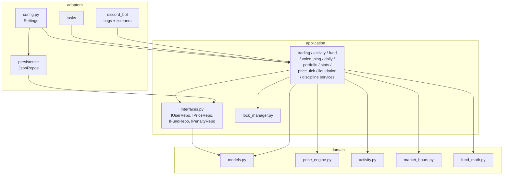

# Friendex — Target Architecture

> **Status: Implemented.** This document describes the architecture that was designed
> and then built. The implementation is **complete as of 2026-05-28**. Two notes on
> divergence from the original design text:
> - Persistence uses **SQLite via async SQLAlchemy 2.0 + Alembic** (Option B from
>   §Persistence Strategy), not the `.tmp`-then-`os.replace()` JSON pattern mentioned
>   in the executive summary below.
> - Multi-guild isolation (per-guild markets) is fully implemented per ADR-0001 and
>   `docs/06-per-guild-markets-migration.md`. Decision #12 in §Open-Questions Resolution
>   is marked superseded accordingly.

## Executive Summary

The refactored Friendex is organized as a layered Python package where domain logic, application orchestration, and Discord/persistence adapters form three concentric rings with dependencies pointing strictly inward. Every piece of mutable game state is owned by typed repository objects rather than bare global dicts, and each repository exposes atomic write operations. Per-user `asyncio.Lock` instances serialise all price and portfolio mutations, eliminating the race conditions identified in Phase 1. All hardcoded Discord IDs, timing constants, and APY parameters are lifted into a `pydantic-settings` configuration class loaded at startup, making the bot deployable to any server without code changes.

---

## Table of Contents

1. [Executive Summary](#executive-summary)
2. [Design Principles](#design-principles)
3. [Proposed Package Layout](#proposed-package-layout)
4. [Module Boundaries and Dependency Direction](#module-boundaries-and-dependency-direction)
5. [Domain Model](#domain-model)
6. [Persistence Strategy](#persistence-strategy)
7. [Config and Secrets](#config-and-secrets)
8. [Logging](#logging)
9. [Error Handling](#error-handling)
10. [Concurrency Model](#concurrency-model)
11. [Background Tasks](#background-tasks)
12. [Discord Interface Layer](#discord-interface-layer)
13. [Open-Questions Resolution](#open-questions-resolution)
14. [Mermaid Diagram](#mermaid-diagram)
15. [Phased Migration Plan](#phased-migration-plan)

---

## Design Principles

**1. Dependency direction is strict and inward.**
`domain` imports nothing from `discord`, `aiofiles`, or any persistence library. `application` imports `domain` and repository interfaces only. `adapters` import both and are the only layer allowed to reference `discord.py` objects or file I/O. Nothing in `domain` or `application` ever imports from `adapters`.

**2. Domain logic is pure and synchronous.**
Price calculations, trending scores, collateral math, and P&L formulae are plain functions and dataclasses with no `await`, no `discord`, and no I/O. They are testable with `pytest` and zero mocking.

**3. Side effects are explicit and deferred.**
No `ensure_*` function calls `save_data()`. Repositories have explicit `save()` / `flush()` methods called only from application-layer use-case functions, never from domain or read paths.

**4. Mutations are serialised per subject.**
Every operation that reads-then-writes a user's account, fund, or price record acquires the subject's `asyncio.Lock` before reading. The lock is released only after the repository write completes. This resolves all race conditions in the Phase 1 risk register.

**5. Typed data, never raw dicts.**
All persisted state is represented by `dataclasses` (domain layer) and serialised/deserialised by repository adapters. String-key dict access with no type safety is eliminated from all non-adapter code.

**6. Configuration before constants.**
Every hardcoded integer, float, set of IDs, or path in the spec skeleton becomes a field on the `Settings` class. The domain layer receives settings values through dependency injection, not module-level globals.

**7. Testability over convenience.**
Background tasks are classes with injected repository and service dependencies. Discord cogs receive service objects in their constructors. Neither tasks nor cogs touch the repository layer directly — they delegate to application services.

**8. Fail visibly.**
Every exception either propagates to a top-level handler that converts it to a Discord-safe error message, or is logged with full context and re-raised. Silent swallowing of exceptions is prohibited.

---

## Proposed Package Layout

```
src/
└── friendex/
    ├── __init__.py
    ├── main.py                         # Entry point: build container, start bot
    │
    ├── domain/                         # Pure logic, no I/O, no discord
    │   ├── __init__.py
    │   ├── models.py                   # All dataclasses (UserAccount, Stock, positions, etc.)
    │   ├── price_engine.py             # apply_trade_impact, apply_floor_stall, activity_return, inactivity_decay
    │   ├── activity.py                 # calculate_trending_score, get_engagement_tier, reset_activity_bucket
    │   ├── market_hours.py             # is_market_open, is_trading_day, is_sunday (time-pure, inject Settings)
    │   └── fund_math.py                # APY accrual, penalty math, net_worth calculation
    │
    ├── application/                    # Use-case orchestration; imports domain + repo interfaces
    │   ├── __init__.py
    │   ├── interfaces.py               # Abstract base classes: IUserRepo, IPriceRepo, IFundRepo, IPenaltyRepo
    │   ├── lock_manager.py             # LockManager: per-user asyncio.Lock factory
    │   ├── trading_service.py          # buy, sell, short, cover use cases
    │   ├── activity_service.py         # record_message, record_reaction, record_voice_join/leave
    │   ├── voice_ping_service.py       # handle_vc_ping_message, reward_voice_ping_response
    │   ├── fund_service.py             # create_fund, withdraw, send_events, invest (stub), accrue_apy
    │   ├── daily_service.py            # claim_daily
    │   ├── portfolio_service.py        # calculate_net_worth, portfolio_snapshot (read-only)
    │   ├── stats_service.py            # trending_snapshot, user_stats (read-only)
    │   ├── price_tick_service.py       # activity_price_tick, inactivity_decay_tick, vc_boost_tick
    │   ├── liquidation_service.py      # check_and_liquidate_shorts
    │   └── discipline_service.py       # apply_discipline_penalty (timeout, ban)
    │
    └── adapters/                       # Discord, persistence, config, time — all side effects here
        ├── __init__.py
        ├── config.py                   # Settings (pydantic-settings), .env loader
        ├── container.py                # Dependency container: constructs repos, services, wires cogs
        ├── persistence/
        │   ├── __init__.py
        │   ├── base_repo.py            # atomic_write() helper (tmp + os.replace)
        │   ├── user_repo.py            # JsonUserRepository implements IUserRepo
        │   ├── price_repo.py           # JsonPriceRepository implements IPriceRepo
        │   ├── fund_repo.py            # JsonFundRepository implements IFundRepo
        │   └── penalty_repo.py         # JsonPenaltyRepository implements IPenaltyRepo
        ├── discord_bot/
        │   ├── __init__.py
        │   ├── bot.py                  # Bot factory: intents, slash-command tree sync, setup_hook
        │   ├── error_handler.py        # Top-level on_command_error and domain-error-to-embed mapper
        │   ├── embeds.py               # All discord.Embed builders (pure functions, no Discord state)
        │   ├── cogs/
        │   │   ├── __init__.py
        │   │   ├── trading_cog.py      # /buy, /sell, /short, /cover
        │   │   ├── portfolio_cog.py    # /portfolio
        │   │   ├── fund_cog.py         # /fund create/info/withdraw/send_events/invest (Group)
        │   │   ├── daily_cog.py        # /daily
        │   │   ├── stats_cog.py        # /trending, /mystats, /price, /mystock
        │   │   ├── account_cog.py      # /balance, /optin, /optout
        │   │   └── admin_cog.py        # /game_intro, /help (manage_guild check)
        │   └── listeners/
        │       ├── __init__.py
        │       ├── message_listener.py # on_message → activity_service + voice_ping_service
        │       ├── voice_listener.py   # on_voice_state_update → activity_service + voice_ping_service
        │       ├── reaction_listener.py # on_reaction_add → activity_service
        │       └── member_listener.py  # on_member_update, on_member_ban → discipline_service
        └── tasks/
            ├── __init__.py
            ├── activity_tick_task.py   # 15-min activity price tick
            ├── inactivity_decay_task.py # 5-min inactivity decay
            ├── liquidation_task.py     # 5-min short liquidation check
            ├── freeze_check_task.py    # 5-min short freeze flag update
            ├── vc_boost_task.py        # 15-min extra VC boost step
            ├── daily_reset_task.py     # midnight reset of activity.today buckets + high_24h/low_24h
            ├── weekly_reset_task.py    # Monday midnight reset of activity.week buckets
            └── monthly_rollover_task.py # 1st of month: capture month_start_net_worth
```

---

## Module Boundaries and Dependency Direction

### Layer Model

```
┌─────────────────────────────────────────────────────────┐
│  adapters  (discord_bot, persistence, tasks, config)     │
│  ↓ imports ↓                                             │
├─────────────────────────────────────────────────────────┤
│  application  (use-cases, services, interfaces)          │
│  ↓ imports ↓                                             │
├─────────────────────────────────────────────────────────┤
│  domain  (models, pure functions)                        │
│  imports: stdlib only (dataclasses, datetime, math)      │
└─────────────────────────────────────────────────────────┘
```

**Explicit rules:**

- `domain/*` must not import `discord`, `aiofiles`, `aiohttp`, any repository class, or any `adapters.*` or `application.*` module.
- `application/*` must not import `discord`, `discord.ext`, or any concrete repository class. It imports only `application.interfaces.*`, `domain.*`, and stdlib.
- `adapters/*` may import anything. It holds all I/O, Discord API calls, and pydantic-settings configuration.
- `container.py` is the only file that imports both concrete repository implementations and application services simultaneously. It wires them at startup.

### Mermaid Layer Diagram



---

## Domain Model

All models live in `src/friendex/domain/models.py`. They are plain `dataclasses` with `frozen=False` (mutable by the application layer) but construction-time invariant checks via `__post_init__`.

```python
@dataclass
class ActivityBucket:
    text_msgs: int = 0
    media_msgs: int = 0
    voice_minutes: float = 0.0
    voice_unique_channels: list[str] = field(default_factory=list)
    reaction_count: int = 0
    reply_count: int = 0
    role_ping_joins: float = 0.0        # float: host gets +0.5 per responder
    role_ping_join_minutes: float = 0.0
    bucket_start: datetime = field(default_factory=datetime.utcnow)

    def __post_init__(self):
        # voice_unique_channels must be a list of str, not int
        self.voice_unique_channels = [str(c) for c in self.voice_unique_channels]


@dataclass
class DailyProgress:
    last_claim: datetime | None
    streak: int

    def __post_init__(self):
        assert self.streak >= 0, "streak must be non-negative"


@dataclass
class LongPosition:
    target_user_id: str
    shares: int
    avg_entry: float

    def __post_init__(self):
        assert self.shares > 0, "shares must be positive"
        assert self.avg_entry > 0, "avg_entry must be positive"


@dataclass
class ShortPosition:
    target_user_id: str
    shares: int
    entry_price: float
    locked_cash: float
    locked_fund: float
    created_at: datetime
    frozen: bool = False

    def __post_init__(self):
        assert self.shares > 0, "shares must be positive"
        assert self.entry_price > 0, "entry_price must be positive"
        assert self.locked_cash >= 0 and self.locked_fund >= 0, \
            "locked collateral must be non-negative"


@dataclass
class UserAccount:
    user_id: str
    cash_balance: float
    net_worth: float                    # stale; refreshed by portfolio_service
    month_start_net_worth: float
    long_positions: dict[str, LongPosition]     # key: target_user_id
    short_positions: dict[str, ShortPosition]   # key: target_user_id
    today: ActivityBucket
    week: ActivityBucket
    daily: DailyProgress
    last_activity: datetime
    opt_in: bool = True
    intro_shown: bool = False

    def __post_init__(self):
        assert self.cash_balance >= 0, "cash_balance must be non-negative"


@dataclass
class PricePoint:
    price: float
    timestamp: datetime


@dataclass
class Stock:
    user_id: str
    current: float
    history: list[PricePoint]           # pruned to last 24h on write
    high_24h: float
    low_24h: float
    all_time_high: float

    def __post_init__(self):
        assert self.current >= 0, "price must be non-negative"


@dataclass
class HedgeFund:
    fund_id: str                        # same as manager's user_id, or "events_wallet"
    name: str
    manager_id: str
    cash_balance: float
    investors: dict[str, float]         # investor_user_id -> invested_amount

    def __post_init__(self):
        assert self.cash_balance >= 0, "fund cash must be non-negative"


@dataclass
class FundPenalty:
    user_id: str
    penalty_apr: float                  # cumulative additive APY reduction
    penalty_until: datetime


@dataclass
class VoiceSession:
    user_id: str
    channel_id: int
    start: datetime
    from_ping_message_ids: set[int]     # message IDs of VC ping messages that triggered join


@dataclass
class VoicePingSession:
    message_id: int
    host_id: str
    channel_id: int
    timestamp: datetime
    first_10_joiners: list[str]         # user IDs in join order, capped at 10
    extra_joiners: list[str]            # user IDs joining after first 10


@dataclass
class VcExtraBoost:
    user_id: str
    ping_time: datetime
    last_boost: datetime
    end_time: datetime
```

**Key invariants enforced at construction:**
- `cash_balance >= 0` on `UserAccount` and `HedgeFund`
- `shares > 0` on both position types (zero-share positions are deleted, not stored)
- `locked_cash >= 0` and `locked_fund >= 0` on `ShortPosition`
- `voice_unique_channels` always stores `str`, never `int`

---

## Persistence Strategy

### Option A — JSON Files Behind Repository Interface (Status Quo, Improved)

**Schema:** Four files unchanged in structure. Each repository loads its file into a dict of typed model objects on startup, maintains the in-memory dict as the live state, and writes atomically on flush.

**Improvement over spec:** Atomic write via `.tmp` + `os.replace()`. Dirty-flag per repository — only write if mutated since last flush. Application services call `repo.mark_dirty()` after mutations; a background flush coroutine calls `repo.flush()` every 30 seconds and after every command.

**Pros:** Zero new dependencies. No migration. Operational footprint is two directories and four files. Works on any machine with a filesystem.

**Cons:** No transactions across repositories (e.g., cash debit + price update are two separate flushes). Read performance degrades as files grow. Concurrent access from multiple bot processes is unsafe (single-process assumption required). Schema evolution is ad-hoc.

**Fit score for 50–1000 active users:** 8/10. JSON files for a single Discord server bot with one active process are entirely adequate. The ATH file for 1000 users with 24h price history will be at most a few hundred KB.

---

### Option B — SQLite + SQLAlchemy 2.0 + Alembic

**Schema sketch:**

```sql
CREATE TABLE users (
    user_id TEXT PRIMARY KEY,
    cash_balance REAL NOT NULL,
    net_worth REAL NOT NULL,
    month_start_net_worth REAL NOT NULL,
    last_activity TEXT NOT NULL,
    opt_in INTEGER NOT NULL DEFAULT 1,
    intro_shown INTEGER NOT NULL DEFAULT 0,
    daily_last_claim TEXT,
    daily_streak INTEGER NOT NULL DEFAULT 0
);

CREATE TABLE long_positions (
    owner_id TEXT NOT NULL,
    target_id TEXT NOT NULL,
    shares INTEGER NOT NULL,
    avg_entry REAL NOT NULL,
    PRIMARY KEY (owner_id, target_id)
);

CREATE TABLE short_positions (
    owner_id TEXT NOT NULL,
    target_id TEXT NOT NULL,
    shares INTEGER NOT NULL,
    entry_price REAL NOT NULL,
    locked_cash REAL NOT NULL,
    locked_fund REAL NOT NULL,
    created_at TEXT NOT NULL,
    frozen INTEGER NOT NULL DEFAULT 0,
    PRIMARY KEY (owner_id, target_id)
);

CREATE TABLE activity_buckets (
    user_id TEXT NOT NULL,
    bucket_type TEXT NOT NULL,  -- 'today' | 'week'
    text_msgs INTEGER NOT NULL DEFAULT 0,
    media_msgs INTEGER NOT NULL DEFAULT 0,
    voice_minutes REAL NOT NULL DEFAULT 0,
    reaction_count INTEGER NOT NULL DEFAULT 0,
    reply_count INTEGER NOT NULL DEFAULT 0,
    role_ping_joins REAL NOT NULL DEFAULT 0,
    role_ping_join_minutes REAL NOT NULL DEFAULT 0,
    bucket_start TEXT NOT NULL,
    PRIMARY KEY (user_id, bucket_type)
);

CREATE TABLE voice_unique_channels (
    user_id TEXT NOT NULL,
    bucket_type TEXT NOT NULL,
    channel_id TEXT NOT NULL,
    PRIMARY KEY (user_id, bucket_type, channel_id)
);

CREATE TABLE stocks (
    user_id TEXT PRIMARY KEY,
    current REAL NOT NULL,
    high_24h REAL NOT NULL,
    low_24h REAL NOT NULL,
    all_time_high REAL NOT NULL
);

CREATE TABLE price_history (
    user_id TEXT NOT NULL,
    price REAL NOT NULL,
    recorded_at TEXT NOT NULL
);

CREATE TABLE hedge_funds (
    fund_id TEXT PRIMARY KEY,
    name TEXT NOT NULL,
    manager_id TEXT NOT NULL,
    cash_balance REAL NOT NULL DEFAULT 0
);

CREATE TABLE fund_investors (
    fund_id TEXT NOT NULL,
    investor_id TEXT NOT NULL,
    invested_amount REAL NOT NULL,
    PRIMARY KEY (fund_id, investor_id)
);

CREATE TABLE fund_penalties (
    user_id TEXT PRIMARY KEY,
    penalty_apr REAL NOT NULL,
    penalty_until TEXT NOT NULL
);
```

**Pros:** Atomic multi-table transactions. Proper 24h queries via SQL `WHERE recorded_at > ?`. Alembic handles schema migrations cleanly. aiosqlite + SQLAlchemy async support.

**Cons:** Adds `sqlalchemy`, `alembic`, `aiosqlite` to dependencies. WAL-mode SQLite is still single-writer. Team must know SQLAlchemy 2.0 async API. Migration tooling adds operational complexity vs. the current audience (small Discord community bot).

**Fit score for 50–1000 active users:** 9/10 for correctness; 6/10 for operational simplicity.

---

### Option C — Redis as Primary Store

**Schema sketch (key patterns):**

```
user:{id}:account      HASH  (cash_balance, net_worth, opt_in, ...)
user:{id}:portfolio:long:{target_id}   HASH  (shares, avg_entry)
user:{id}:portfolio:short:{target_id} HASH  (shares, entry_price, locked_cash, ...)
user:{id}:activity:today   HASH
user:{id}:activity:week    HASH
stock:{id}              HASH  (current, high_24h, low_24h, ath)
stock:{id}:history      ZSET  (score=unix_ts, member=price_json)
fund:{id}               HASH  (name, manager_id, cash_balance)
penalty:{id}            HASH  (penalty_apr, penalty_until)
trade_cooldown:{id}     STRING with TTL
```

**Pros:** Native TTL for trade cooldowns and penalties. Atomic operations (`HINCRBY`, `SET NX`) for concurrency-safe increments. ZSET for price history with automatic 24h window via `ZREMRANGEBYSCORE`. Pub/sub available for future multi-process bots.

**Cons:** Requires a Redis instance (Docker, managed Redis, or a sidecar). Default Redis is in-memory only — persistence requires `RDB` snapshots or `AOF` (append-only file). Memory-resident: 1000 users with full history may use 20–50 MB RAM depending on history depth. Adds operational overhead: Redis must be running and healthy for the bot to function at all. The dev/test environment needs Redis even for unit testing unless a mock layer is added.

**Deployment:** `docker-compose.yml` with `redis:7-alpine` and `appendonly yes`. AOF gives per-command durability. Monthly cost on a small VPS is negligible.

**Fit score for 50–1000 active users:** 7/10. Correct and fast, but over-engineered for a single-process single-server bot where SQLite provides the same transactional guarantees with zero daemon dependency.

---

### Recommendation: Option B — SQLite + SQLAlchemy 2.0 + Alembic

**Reasoning:** The core problems from Phase 1 — race conditions, corrupt file writes, silent data loss during background ticks, and no schema migration story — are all solved cleanly by SQLite's write-ahead logging and SQLAlchemy transactions. The operational footprint is a single `.db` file alongside the bot (same as the current JSON files, but atomic). `aiosqlite` integrates natively with `asyncio`. Alembic handles every future schema change without ad-hoc backfill guards. The dependencies are mature, well-documented, and standard for Python Discord bots at this scale.

Redis is not warranted here: the bot is single-process, there is no multi-server scenario in scope (Open Question 12 deferred), and the TTL-based features Redis offers (trade cooldowns) can be handled by a `trade_cooldowns` table with a `expires_at` column and a 5-minute sweep task. JSON is retained only as a migration source format.

**JSON → SQLite Migration Sketch:**

```python
# run once: python -m friendex.adapters.persistence.migrate_json_to_sqlite

from pathlib import Path
import json
from friendex.adapters.persistence.db import engine, Base
from friendex.adapters.persistence import user_repo, price_repo, fund_repo, penalty_repo

Base.metadata.create_all(engine)

users = json.loads(Path("data/users.json").read_text())
prices = json.loads(Path("data/prices.json").read_text())
funds = json.loads(Path("data/funds.json").read_text())
penalties = json.loads(Path("data/fund_penalties.json").read_text())

with Session(engine) as session:
    for uid, u in users.items():
        session.merge(map_user_dict_to_orm(uid, u))
    for uid, p in prices.items():
        session.merge(map_price_dict_to_orm(uid, p))
    for fid, f in funds.items():
        session.merge(map_fund_dict_to_orm(fid, f))
    for uid, pen in penalties.items():
        session.merge(map_penalty_dict_to_orm(uid, pen))
    session.commit()
```

The migration is idempotent (uses `merge`). Run it once before the first bot start with the new code. The old JSON files are left in place as a backup.

---

## Config and Secrets

### Settings Class

`src/friendex/adapters/config.py`

```python
from pydantic_settings import BaseSettings, SettingsConfigDict
from pydantic import Field
from datetime import time

class Settings(BaseSettings):
    model_config = SettingsConfigDict(
        env_file=".env",
        env_file_encoding="utf-8",
        extra="ignore",
    )

    # Discord
    # Slash commands sync to ``guild_id`` — there is no message-content prefix.
    discord_token: str
    guild_id: int

    # Database
    database_url: str = "sqlite+aiosqlite:///data/friendex.db"

    # Market hours
    market_open: time = time(6, 30)
    market_close: time = time(4, 30)    # CORRECTED from skeleton's 06:25
    timezone_offset_hours: int = 0

    # Game constants
    initial_cash: float = 10_000.0
    initial_price: float = 100.0
    daily_reward: float = 500.0
    streak_bonus: float = 500.0
    min_price: float = 70.0
    price_impact_k: float = 0.5
    inactivity_threshold_seconds: int = 4 * 3600
    inactivity_decay: float = 0.04
    liquidation_threshold: float = 1.5
    short_freeze_minutes: int = 30
    trade_cooldown_seconds: int = 900
    discipline_penalty: float = 0.17

    # Activity tick
    activity_tick_minutes: int = 15

    # VC ping
    vc_ping_role_ids: list[int] = Field(default_factory=list)
    voice_ping_window_seconds: int = 5400
    fast_response_seconds: int = 120
    medium_response_seconds: int = 300
    vc_extra_boost_interval_seconds: int = 900

    # Photo bonus
    photo_bonus_channel_ids: list[int] = Field(default_factory=list)

    # Hedge fund
    hedge_fund_base_apy: float = 0.15
    early_withdraw_penalty: float = 0.05
    penalty_duration_days: int = 14

    # Logging
    log_level: str = "INFO"
    log_format: str = "json"            # "json" | "console"
```

### `.env.example`

```dotenv
# Required
DISCORD_TOKEN=your_bot_token_here
GUILD_ID=123456789012345678

# Optional — override defaults
# (Commands are slash commands synced to GUILD_ID — there is no command prefix.)
DATABASE_URL=sqlite+aiosqlite:///data/friendex.db
MARKET_OPEN=06:30
MARKET_CLOSE=04:30
TIMEZONE_OFFSET_HOURS=0

# Game tuning
INITIAL_CASH=10000
INITIAL_PRICE=100
MIN_PRICE=70
PRICE_IMPACT_K=0.5
INACTIVITY_DECAY=0.04
LIQUIDATION_THRESHOLD=1.5
SHORT_FREEZE_MINUTES=30
TRADE_COOLDOWN_SECONDS=900
DISCIPLINE_PENALTY=0.17

# Discord role/channel IDs (comma-separated)
VC_PING_ROLE_IDS=1331261849488068628,1299178128526282834,1303650629821923378,1302158123221651519
PHOTO_BONUS_CHANNEL_IDS=1295236476925378613,1299105121006784707

# Hedge fund
HEDGE_FUND_BASE_APY=0.15
EARLY_WITHDRAW_PENALTY=0.05
PENALTY_DURATION_DAYS=14

# Logging
LOG_LEVEL=INFO
LOG_FORMAT=json
```

---

## Logging

**Decision: `structlog` with JSON output in production, colored console output in development.**

**Reasoning:** The bot emits high-frequency events (every message, every reaction, every VC join). Structured key-value logs are essential for filtering by `user_id`, `guild_id`, or `command` without regex parsing. `structlog` integrates with stdlib `logging` (so `discord.py` internal logs flow through the same sink) and supports async-safe context binding.

### Log Event Schema

Every log record carries at minimum:

```json
{
  "level": "info",
  "event": "trade.buy.completed",
  "timestamp": "2026-05-13T14:22:01.123Z",
  "user_id": "123456789",
  "guild_id": "987654321",
  "target_id": "111222333",
  "shares": 10,
  "price": 142.50,
  "cost": 1425.00,
  "latency_ms": 34,
  "logger": "friendex.application.trading_service"
}
```

Error records additionally carry:

```json
{
  "level": "error",
  "event": "trade.buy.failed",
  "error": "InsufficientFunds",
  "error_detail": "need 1425.00, have 200.00",
  "exc_info": true
}
```

### Initialization

```python
# adapters/config.py (logging setup, called in main.py)
import structlog

def configure_logging(settings: Settings) -> None:
    processors = [
        structlog.contextvars.merge_contextvars,
        structlog.processors.add_log_level,
        structlog.processors.TimeStamper(fmt="iso"),
    ]
    if settings.log_format == "json":
        processors.append(structlog.processors.JSONRenderer())
    else:
        processors.append(structlog.dev.ConsoleRenderer())

    structlog.configure(
        processors=processors,
        wrapper_class=structlog.make_filtering_bound_logger(
            getattr(logging, settings.log_level.upper())
        ),
        context_class=dict,
        logger_factory=structlog.PrintLoggerFactory(),
    )
```

---

## Error Handling

### Exception Taxonomy

**Domain errors** (`src/friendex/domain/errors.py`):
These represent game-rule violations. They carry a `user_facing_message: str` field that the Discord error handler can relay directly.

```
DomainError (base)
├── InsufficientFunds(need: float, have: float)
├── MarketClosed(open_at: time, close_at: time)
├── PositionFrozen(target_id: str)
├── OnCooldown(seconds_remaining: int)
├── OptedOut(target_id: str)
├── NoPosition(target_id: str, position_type: str)
├── InsufficientShares(requested: int, held: int)
├── SelfTrade()
├── InvalidAmount(reason: str)
├── FundInsufficientBalance(need: float, have: float)
└── AlreadyOptedIn() / AlreadyOptedOut()
```

**Infrastructure errors** (not user-facing; logged and re-raised or suppressed at the adapter boundary):

```
FriendexError (base)
├── PersistenceError(operation: str, detail: str)
└── DiscordError(detail: str)
```

### Error Flow

```
Discord slash-command interaction
    → cog app_command callback
        → application service
            → raises DomainError            ← game rule violated
        OR → raises PersistenceError        ← DB write failed
    → top-level on_command_error handler (adapters/discord_bot/error_handler.py)
        DomainError           → embed with error.user_facing_message, ephemeral reply
        PersistenceError      → log ERROR with full context; reply "Internal error, try again"
        commands.MissingRequiredArgument → reply with usage hint
        commands.MemberNotFound          → reply "User not found"
        Exception (fallthrough) → log CRITICAL; reply "Unexpected error"
```

Background task errors follow the same pattern but the `on_command_error` handler is not in play — each task's `run()` method wraps its body in `try/except Exception as e: log.error("task.failed", task=self.__class__.__name__, exc_info=True)` and continues the loop. Tasks never propagate exceptions to the event loop.

---

## Concurrency Model

### Per-User Locks

`src/friendex/application/lock_manager.py` holds a `defaultdict(asyncio.Lock)` keyed by `user_id`. It is a singleton passed by dependency injection to all application services.

```python
class LockManager:
    def __init__(self):
        self._locks: dict[str, asyncio.Lock] = {}
        self._meta_lock = asyncio.Lock()

    async def acquire(self, user_id: str) -> asyncio.Lock:
        async with self._meta_lock:
            if user_id not in self._locks:
                self._locks[user_id] = asyncio.Lock()
        return self._locks[user_id]

    @asynccontextmanager
    async def locked(self, *user_ids: str):
        # Sort IDs to prevent deadlock when acquiring multiple locks
        ids = sorted(set(user_ids))
        locks = [await self.acquire(uid) for uid in ids]
        for lock in locks:
            await lock.acquire()
        try:
            yield
        finally:
            for lock in reversed(locks):
                lock.release()
```

### Serialisation Strategy

**Trade commands (`/buy`, `/sell`, `/short`, `/cover`):** Acquire locks for both the **buyer/seller** and the **target** (the stock being traded). Lock acquisition is sorted by ID to prevent deadlock.

**Activity events (`on_message`, `on_reaction_add`):** Acquire lock for the **author** only.

**Voice state update:** Acquire lock for the **member** who joined/left.

**Background tasks:** Each task iteration acquires the lock for each user it processes, one at a time. Tasks do not hold multiple user locks simultaneously except where atomicity genuinely requires it (e.g., short liquidation must lock both the short-holder and the target).

**Ordering:** No command or event handler holds a user lock for more than one `await` that involves I/O outside the repository layer. The repository `session.commit()` is the only I/O inside a lock.

**This resolves the following Phase 1 risks:**
- Concurrent `/buy`/`/sell`/`/short` race on same target price: resolved — both buyer and target are locked before any read.
- `save_data()` concurrent file writes: resolved — SQLite WAL serialises writers natively; aiosqlite's single connection also serialises writes at the Python level.
- `calculate_net_worth` side-effect write during read: resolved — `ensure_*` functions no longer call `save_data()`; the portfolio service reads without acquiring any lock (reads are always consistent because writes are serialised).

---

## Background Tasks

**Framework decision: `discord.ext.tasks` over APScheduler.**

APScheduler adds a dependency and a separate scheduler lifecycle for no benefit here — all tasks are fixed-interval loops with no cron-style scheduling except the midnight resets, which are handled by checking `datetime.utcnow().hour == 0` and a `last_run` date flag within the `daily_reset_task` loop body. `discord.ext.tasks` is already a dependency of `discord.py` and integrates cleanly with the bot's event loop.

Each task is a class in `adapters/tasks/`. The constructor receives only injected application services. The class registers itself with `discord.ext.tasks.loop` via a method. Tasks are started from `on_ready` in `bot.py` via the dependency container.

### Task Catalogue

| Task class | Interval | Service used | Phase 1 issue addressed |
|---|---|---|---|
| `ActivityTickTask` | 15 min | `PriceTickService.activity_price_tick()` | Existing |
| `InactivityDecayTask` | 5 min | `PriceTickService.inactivity_decay_tick()` | Existing |
| `LiquidationTask` | 5 min | `LiquidationService.check_and_liquidate_shorts()` | **Was stub — implemented** |
| `FreezeCheckTask` | 5 min | `TradingService.update_frozen_shorts()` | Existing |
| `VcBoostTask` | 15 min | `PriceTickService.vc_boost_tick()` | Existing |
| `DailyResetTask` | 1 min (checks wall clock) | `ActivityService.reset_today_buckets()`, `PriceTickService.reset_24h_high_low()` | **Missing — new** |
| `WeeklyResetTask` | 1 min (checks wall clock) | `ActivityService.reset_week_buckets()` | **Missing — new** |
| `MonthlyRolloverTask` | 1 hr | `PortfolioService.capture_month_start_net_worth()` | **Was stub — implemented** |

### Task Structure Example

```python
# adapters/tasks/liquidation_task.py
from discord.ext import tasks
from friendex.application.liquidation_service import LiquidationService
import structlog

log = structlog.get_logger()

class LiquidationTask:
    def __init__(self, liquidation_service: LiquidationService):
        self._service = liquidation_service

    def start(self):
        self._loop.start()

    @tasks.loop(minutes=5)
    async def _loop(self):
        try:
            await self._service.check_and_liquidate_shorts()
        except Exception:
            log.error("task.failed", task="LiquidationTask", exc_info=True)
```

### Missing Tasks — Implementation Notes

**`DailyResetTask`:** Runs every 1 minute, checks if `datetime.utcnow().date()` has advanced past its stored `last_reset_date`. On trigger: calls `ActivityService.reset_today_buckets()` for all users and `PriceTickService.reset_24h_high_low()`. The `last_reset_date` is stored in the database (a single `system_state` table row) to survive restarts.

**`WeeklyResetTask`:** Same mechanism, checks `datetime.utcnow().weekday() == 0` (Monday) and that `last_week_reset` is not already this week.

**`LiquidationTask`:** Iterates all `ShortPosition` records where `entry_price * LIQUIDATION_THRESHOLD <= current_price`. For each, acquires locks for both holder and target, executes a cover at current price, and emits a Discord notification to the guild's configured notification channel. A frozen position is still eligible for liquidation (the freeze only prevents manual cover; auto-liquidation overrides it).

**`MonthlyRolloverTask`:** On the 1st of the month, calls `PortfolioService.calculate_net_worth(user_id)` for every user and writes the result to `month_start_net_worth`. This correctly populates the field that has been a creation-time stub.

---

## Discord Interface Layer

### Cog Pattern

Each cog is a `commands.Cog` subclass holding **slash commands** (`discord.app_commands`). The constructor receives only the application service(s) it needs, injected by `container.py`. Cogs do not import repository classes. Cogs call service methods and then call embed builder functions from `adapters/discord_bot/embeds.py` to construct responses.

Commands are declared with `@app_commands.command` and receive a `discord.Interaction` (not a `commands.Context`). Parameter types (`discord.Member`, `int`) are validated by Discord *before* the callback runs, so hand-rolled mention/int parsing disappears. Replies go through the interaction: the `ephemeral` flag replaces the old `delete_after=15` cleanup — `True` for personal/read commands, `False` for action commands so trades stay visible in-channel. Commands that do async work `defer()` first, then `followup.send(...)` (the slash equivalent of the old `async with ctx.typing()`).

```python
# adapters/discord_bot/cogs/trading_cog.py
class TradingCog(commands.Cog):
    def __init__(self, trading_service: TradingService, settings: Settings):
        self._trading = trading_service
        self._settings = settings

    @app_commands.command(name="buy", description="Buy shares of a member's stock")
    @app_commands.describe(user="Whose stock to buy", shares="How many shares")
    async def buy(
        self,
        interaction: discord.Interaction,
        user: discord.Member,
        shares: app_commands.Range[int, 1],  # Discord enforces shares >= 1
    ) -> None:
        await interaction.response.defer()  # actions are public (not ephemeral)
        result = await self._trading.buy(
            buyer_id=str(interaction.user.id),
            target_id=str(user.id),
            shares=shares,
        )
        embed = build_buy_confirmation_embed(result)
        await interaction.followup.send(embed=embed)
```

### Cog Inventory

| Cog | Commands | Reply visibility | Application Services |
|---|---|---|---|
| `TradingCog` | `/buy`, `/sell`, `/short`, `/cover` | public | `TradingService` |
| `PortfolioCog` | `/portfolio` | ephemeral | `PortfolioService` |
| `FundCog` | `/fund create/info/withdraw/send_events/invest` | info ephemeral; mutations public | `FundService` |
| `DailyCog` | `/daily` | public | `DailyService` |
| `StatsCog` | `/trending`, `/mystats`, `/price`, `/mystock` | `/trending` public; rest ephemeral | `StatsService`, `PortfolioService` |
| `AccountCog` | `/balance`, `/optin`, `/optout` | ephemeral | `PortfolioService`, `ActivityService` |
| `AdminCog` | `/game_intro`, `/help` | `/game_intro` public; `/help` ephemeral | None (static embeds) |

`/fund` is a `discord.app_commands.Group`: its subcommands surface as `/fund create`, `/fund info`, `/fund withdraw`, `/fund send_events`, and `/fund invest`. Slash commands have no aliases, so the original `$mb` / `$pf` / `$mp` / `$ticker` aliases are dropped — Discord's command autocomplete replaces them, and `$my_stock` becomes the standalone `/mystock`.

### Listener Inventory

Each listener is a `commands.Cog` subclass registered with `bot.add_cog()`. Listeners depend only on application services.

| Listener class | Events handled | Application Services |
|---|---|---|
| `MessageListener` | `on_message` | `ActivityService`, `VoicePingService` |
| `VoiceListener` | `on_voice_state_update` | `ActivityService`, `VoicePingService` |
| `ReactionListener` | `on_reaction_add` | `ActivityService` |
| `MemberListener` | `on_member_update`, `on_member_ban` | `DisciplineService` |

### Command/Listener Independence

Listeners do not call cog methods and cogs do not call listener methods. Both delegate to the same application services. This means the activity recording for a `/buy` (if any) goes through `ActivityService` called from `MessageListener`, not from `TradingCog`. The separation is clean.

---

## Open-Questions Resolution

| # | Question | Decision |
|---|---|---|
| 1 | `MARKET_CLOSE` is `time(6, 25)` but spec says `04:30`. | **Architectural decision: use `04:30`.** The constant is moved to `Settings.market_close` with default `time(4, 30)`. The skeleton value is a typo. The `is_market_open` overnight-window branch requires `MARKET_OPEN > MARKET_CLOSE`, which is satisfied by `06:30 > 04:30`. |
| 2 | Sunday buy-only: is `/buy` intentionally exempt from Sunday closed? | **Deferred to implementation phase.** The architecture makes market-hours enforcement a single call to `market_hours.is_market_open(dt, command_type)` with an optional `allow_sunday_buy: bool` parameter. The business rule is encoded in `Settings.sunday_buy_allowed: bool = True` so it can be toggled without code changes. |
| 3 | `opt_in` flag: does opt-out make a user untradeable? | **Architectural decision: enforce the flag.** `TradingService.buy/sell/short` checks `target.opt_in` and raises `OptedOut` if False. The spec's CLAUDE.md says "Consent to be a tradeable stock." The confirmation text saying "still tradable" is treated as incorrect copy. A `settings.opt_out_blocks_trading: bool = True` toggle is provided for the implementation team to override if the game-design decision reverses. |
| 4 | Activity bucket reset schedule. | **Architectural decision: UTC midnight for `today`; Monday 00:00 UTC for `week`.** `DailyResetTask` and `WeeklyResetTask` are added (see Background Tasks). The reset time is configurable via `Settings.daily_reset_hour_utc: int = 0`. |
| 5 | Hedge fund: personal savings or multi-investor? | **Deferred to implementation phase.** The domain model supports both: `HedgeFund.investors` dict is present. `FundService` has an `invest(investor_id, fund_id, amount)` method stubbed out. The `/fund invest` command is scaffolded in `FundCog` with a `raise NotImplementedError` body. The APY accrual in `MonthlyRolloverTask` is implemented for the manager's balance (single-user case) and documented to extend to investors when the invest command is built. |
| 6 | 50% VC leave boost: 60-minute stay or ping-join condition? | **Deferred to implementation phase.** `VoiceSession.from_ping_message_ids` carries the data needed for either condition. `ActivityService.handle_voice_leave` receives both `stay_minutes` and `joined_from_ping: bool`. The business rule is a single `if` in the service — whichever condition the implementation team picks is a one-line change. |
| 7 | `short_liquidation_check` stub: implement or defer? | **Architectural decision: implement.** `LiquidationTask` and `LiquidationService` are full first-class components in this architecture. The stub is the highest-risk item in the Phase 1 risk register. |
| 8 | `HEDGE_FUND_BASE_APY = 0.15`: 15% monthly or annual? | **Deferred to implementation phase.** `Settings.hedge_fund_base_apy_period: str = "monthly"` provides a toggle. `fund_math.py` has a function `compute_apy_accrual(balance, apy, period)` that handles both cases. The game-design intent must be confirmed by the project owner. |
| 9 | `high_24h` / `low_24h` never reset: task or dynamic query? | **Architectural decision: dynamic query from history.** `StatsService.get_price_stats(user_id)` computes `high_24h` and `low_24h` at read time by scanning `Stock.history` for records within the last 24 hours. Stored `high_24h` / `low_24h` fields are removed from the `Stock` model. `all_time_high` is retained as a stored field. `DailyResetTask` no longer needs to reset these fields. |
| 10 | `intro_shown` / `/game_intro` distribution. | **Deferred to implementation phase.** Architecture is neutral: `/optin` calls `ActivityService.mark_intro_shown(user_id)`. `/game_intro` posts the embed to the current channel. No auto-post logic is added unless explicitly requested. |
| 11 | `voice_ping_sessions` stores `set()` of message IDs — not JSON-serializable. | **Architectural decision: store as `list[int]` in the domain model, deduplicate in the service layer.** `VoiceSession.from_ping_message_ids` is typed `set[int]` in memory. The repository serialises it as a JSON array on write and deserialises back to a `set` on read. The service never exposes the raw set to persistence. |
| 12 | Multi-guild isolation: in scope? | **⚠️ SUPERSEDED by [ADR-0001](./adr/0001-per-guild-markets.md) (per-guild markets) — 2026-05-22.** ~~**Architectural decision: single-guild only for this refactor.** `Settings.guild_id: int` is a required field. All repository queries implicitly scope to this guild. If multi-guild support is needed later, adding a `guild_id` column to every table is a single Alembic migration — the repository interface already isolates callers from storage details, so the application layer requires no changes.~~ **Erratum:** that last sentence is wrong for a one-bot-many-guilds deployment — `guild_id` is a runtime dimension that must thread through ORM composite keys, container-scoped repositories, the Discord adapter boundary (extract `interaction.guild_id`, reject DMs), and per-guild background tasks. New decision: per-guild markets via `container.for_guild(guild_id)` (Approach C); domain models stay guild-agnostic. See ADR-0001 and [`06-per-guild-markets-migration.md`](./06-per-guild-markets-migration.md). |

---

## Mermaid Diagram

```mermaid
graph TD
    subgraph adapters["adapters layer"]
        subgraph discord_bot
            COGS["TradingCog\nPortfolioCog\nFundCog\nDailyCog\nStatsCog\nAccountCog\nAdminCog"]
            LISTENERS["MessageListener\nVoiceListener\nReactionListener\nMemberListener"]
            ERR[error_handler.py]
            EMBEDS[embeds.py]
        end
        subgraph tasks_layer["tasks"]
            TASKS["ActivityTickTask\nInactivityDecayTask\nLiquidationTask\nFreezeCheckTask\nVcBoostTask\nDailyResetTask\nWeeklyResetTask\nMonthlyRolloverTask"]
        end
        subgraph persistence_layer["persistence"]
            REPOS["JsonUserRepo\nJsonPriceRepo\nJsonFundRepo\nJsonPenaltyRepo"]
        end
        CONFIG[config.py / Settings]
        CONTAINER[container.py]
    end

    subgraph application["application layer"]
        TRADING_SVC[trading_service]
        ACTIVITY_SVC[activity_service]
        VOICE_SVC[voice_ping_service]
        FUND_SVC[fund_service]
        DAILY_SVC[daily_service]
        PORTFOLIO_SVC[portfolio_service]
        STATS_SVC[stats_service]
        PRICE_TICK_SVC[price_tick_service]
        LIQ_SVC[liquidation_service]
        DISC_SVC[discipline_service]
        INTERFACES["interfaces.py\nIUserRepo / IPriceRepo\nIFundRepo / IPenaltyRepo"]
        LOCKS[lock_manager.py]
    end

    subgraph domain["domain layer"]
        MODELS[models.py]
        PRICE_ENG[price_engine.py]
        ACTIVITY_DOM[activity.py]
        MKT_HRS[market_hours.py]
        FUND_MATH[fund_math.py]
    end

    CONTAINER -->|constructs| REPOS
    CONTAINER -->|injects repos into| TRADING_SVC & ACTIVITY_SVC & VOICE_SVC & FUND_SVC & DAILY_SVC & PORTFOLIO_SVC & STATS_SVC & PRICE_TICK_SVC & LIQ_SVC & DISC_SVC
    CONTAINER -->|injects services into| COGS & LISTENERS & TASKS

    COGS --> TRADING_SVC & ACTIVITY_SVC & FUND_SVC & DAILY_SVC & PORTFOLIO_SVC & STATS_SVC
    LISTENERS --> ACTIVITY_SVC & VOICE_SVC & DISC_SVC
    TASKS --> PRICE_TICK_SVC & LIQ_SVC & ACTIVITY_SVC
    ERR -.->|catches| COGS

    TRADING_SVC & ACTIVITY_SVC & VOICE_SVC & FUND_SVC & DAILY_SVC & PORTFOLIO_SVC & STATS_SVC & PRICE_TICK_SVC & LIQ_SVC & DISC_SVC --> INTERFACES
    TRADING_SVC & ACTIVITY_SVC & VOICE_SVC & FUND_SVC & DAILY_SVC & PORTFOLIO_SVC & STATS_SVC & PRICE_TICK_SVC & LIQ_SVC & DISC_SVC --> LOCKS

    TRADING_SVC --> PRICE_ENG & MKT_HRS & MODELS
    ACTIVITY_SVC --> ACTIVITY_DOM & MODELS
    PRICE_TICK_SVC --> PRICE_ENG & ACTIVITY_DOM & MODELS
    PORTFOLIO_SVC --> FUND_MATH & MODELS
    FUND_SVC --> FUND_MATH & MODELS
    LIQ_SVC --> PRICE_ENG & MODELS
    DISC_SVC --> PRICE_ENG & MODELS

    REPOS -->|implement| INTERFACES
    REPOS -->|read/write| DB[(SQLite DB)]
    CONFIG -->|injected into| TRADING_SVC & PRICE_TICK_SVC & ACTIVITY_SVC & FUND_SVC & DAILY_SVC & LIQ_SVC & DISC_SVC & MKT_HRS
```



---

## Phased Migration Plan

> **Complete.** All phases shipped as of 2026-05-28. The detailed per-file build sequence
> is in `docs/04-migration-plan.md`. What follows is the high-level outline from the
> original design document.

**Phase 0 — Foundation**
Establish the package skeleton, `pyproject.toml` with pinned dependencies (`discord.py`, `sqlalchemy[asyncio]`, `aiosqlite`, `alembic`, `pydantic-settings`, `structlog`), `Settings` class, SQLAlchemy models, Alembic baseline migration, and the `LockManager`. No game logic yet.

**Phase 1 — Domain Layer**
Implement all domain dataclasses and pure functions: `models.py`, `price_engine.py`, `activity.py`, `market_hours.py`, `fund_math.py`. Write unit tests for every public function in this layer. No Discord, no DB.

**Phase 2 — Persistence Layer**
Implement repository interfaces and SQLite-backed concrete repositories. Write integration tests against a test SQLite database. Implement and test the JSON-to-SQLite migration script.

**Phase 3 — Application Services**
Implement all application services in dependency order: `activity_service` → `price_tick_service` → `trading_service` → `portfolio_service` → `stats_service` → `fund_service` → `daily_service` → `voice_ping_service` → `liquidation_service` → `discipline_service`. Write unit tests with mock repositories.

**Phase 4 — Background Tasks**
Implement all `adapters/tasks/` classes including the two new reset tasks and the fully-implemented liquidation and monthly rollover tasks. Write integration tests.

**Phase 5 — Discord Interface**
Implement cogs, listeners, embed builders, error handler, and the dependency container. Write integration tests using `discord.py` test utilities or a mock bot context.

**Phase 6 — Migration and Cutover**
Run migration script against production `data/*.json`. Run bot in shadow mode (no writes to Discord) to verify data integrity. Smoke test each command. Switch over.

**Phase 7 — Hardening**
Address any post-cutover issues. Implement remaining deferred items: `/fund invest`, APY accrual to investors, Sunday-buy rule confirmation, hedge fund APY period confirmation.
